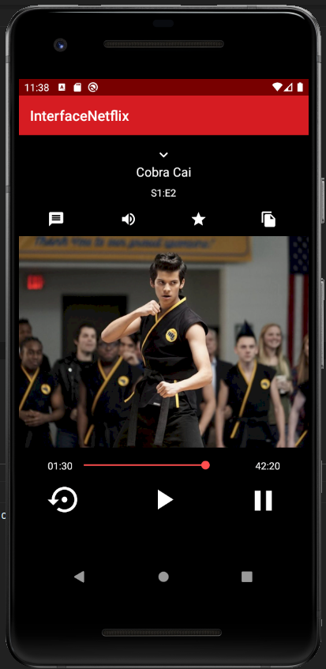

## An example of how to create a similar Netflix Interface User using Android Constraint Layouts

* Android ConstraintLayout
* Android Vector Assets
* constraintlayout.widget.Guideline

### Reference
* https://developer.android.com/reference/androidx/constraintlayout/widget/ConstraintLayout
* https://developer.android.com/reference/androidx/constraintlayout/widget/Guideline
* Udemy - Desenvolvimento Android Completo 2021 - aula 37